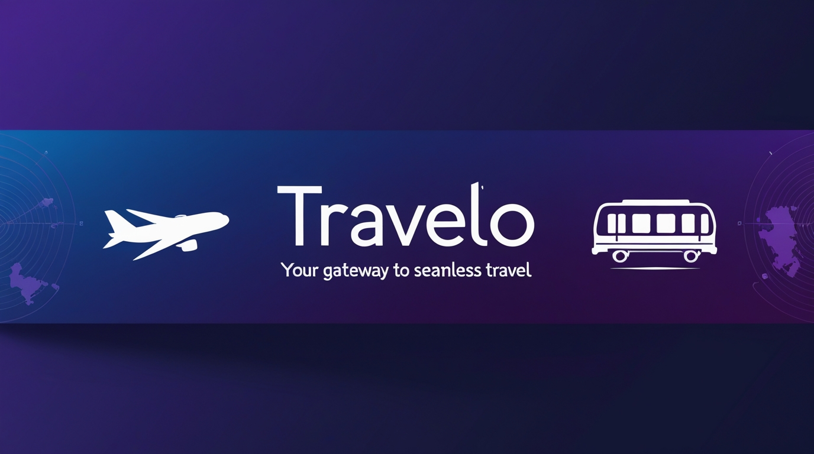

# 🌍 TRAVELO - Travel Booking Website


---


> **A comprehensive travel booking platform for buses, trains, and airlines with an intuitive user interface and seamless booking experience.**

---

## 📋 Table of Contents

- [Overview](#overview)
- [Features](#features)
- [File Structure](#file-structure)
- [Technologies Used](#technologies-used)
- [Installation](#installation)
- [Usage](#usage)
- [Screenshots](#screenshots)
- [Contributing](#contributing)
- [License](#license)
- [Contact](#contact)

---

## 🎯 Overview

**TRAVELO** is a modern travel booking website that allows users to book bus, train, and airline tickets seamlessly. The platform features a clean, user-friendly interface with comprehensive information about various travel services and popular destinations across India.

### Key Highlights:
- 🚌 Bus ticket booking
- 🚆 Train ticket reservations
- ✈️ Airline ticket booking
- 🗺️ Popular destination showcases
- 📱 Responsive design
- 📝 Easy booking form

---

## ✨ Features

### 🎫 Multi-Service Booking
- **Bus Tickets**: Book bus tickets with detailed service information
- **Train Tickets**: IRCTC integration for railway bookings
- **Airline Tickets**: Flight booking with various airline partners

### 🏆 User Experience
- Clean and intuitive navigation
- Comprehensive booking form with validation
- VIP and Standard ticket options
- Date and time selection
- Mobile-responsive design

### 🌟 Destination Showcase
- Featured destinations including:
  - Tamil Nadu
  - Nagaland
  - Puri
  - Darjeeling
  - Mathura
  - Varanasi
  - Ladakh
  - Goa

### 📄 Additional Features
- Search functionality for destinations
- Terms and conditions section
- Service categories display
- Interactive service cards

---

## 📁 File Structure

```
travelo-booking-website/
│
├── 📄 booking_website.html          # Main HTML file
├── 🎨 booking_website.css           # Stylesheet (to be implemented)
│
├── 🖼️ assets/
│   ├── logo.png                     # Website logo
│   ├── yellowbus.logo.gif           # Bus service icon
│   ├── train_logo.png               # Train service icon
│   ├── airline_logo-removebg-preview.png  # Airline icon
│   │
│   └── destinations/
│       ├── place3.jfif              # Varanasi
│       ├── place4.jpg               # Mathura
│       ├── place5.jfif              # Darjeeling
│       ├── place6.jpg               # Puri
│       ├── place7.jpg               # Nagaland
│       ├── place8.jfif              # Tamil Nadu
│       ├── place9.jfif              # Ladakh
│       └── goa.jfif                 # Goa
│
├── 📖 README.md                     # Project documentation
└── 📜 LICENSE                       # License file
```

---

## 🛠️ Technologies Used

| Technology | Purpose |
|------------|---------|
|  | Structure and content |
|  | Styling and layout |
|  | Typography (Sofia, Montserrat) |

---

## 🚀 Installation

### Prerequisites
- A modern web browser (Chrome, Firefox, Safari, Edge)
- Text editor (VS Code, Sublime Text, etc.)
- Basic knowledge of HTML/CSS

### Steps

1. **Clone the repository**
```bash
git clone https://github.com/yourusername/travelo-booking-website.git
```

2. **Navigate to the project directory**
```bash
cd travelo-booking-website
```

3. **Open the project**
```bash
# Open with default browser
open booking_website.html

# Or open with VS Code
code .
```

4. **Add CSS styling**
   - The CSS file is currently empty
   - Add your custom styles to `booking_website.css`

---

## 💻 Usage

### Running the Website

1. Open `booking_website.html` in your preferred web browser
2. Navigate through different sections using the navigation menu
3. Explore services, categories, and destinations
4. Fill out the booking form to make a reservation

### Navigation Structure

- **HOME**: Landing page with welcome message
- **ABOUT**: Information about Travelo
- **CATEGORIES**: Service categories (Redbus, IRCTC, Vistara)
- **BLOGS**: Travel blogs and articles
- **BOOKINGS**: Booking form section
- **SERVICES**: Detailed service information
- **CALL US**: Contact information
- **RATE US**: Rating and feedback
- **SETTINGS**: User settings

---

## 📸 Screenshots

### Homepage
*Welcome section with travel information*

### Services Section
*Bus, Train, and Airline booking options*

### Booking Form
*Comprehensive form for ticket reservations*

### Destinations Gallery
*Showcase of popular Indian destinations*

---

## 🤝 Contributing

Contributions are welcome! Here's how you can help:

1. **Fork the repository**
2. **Create a feature branch**
```bash
git checkout -b feature/AmazingFeature
```
3. **Commit your changes**
```bash
git commit -m 'Add some AmazingFeature'
```
4. **Push to the branch**
```bash
git push origin feature/AmazingFeature
```
5. **Open a Pull Request**

### Areas for Improvement
- [ ] Complete CSS styling implementation
- [ ] Add JavaScript functionality
- [ ] Implement form validation
- [ ] Add backend integration
- [ ] Create mobile-responsive design
- [ ] Add payment gateway
- [ ] Implement booking confirmation system

---

## 📝 To-Do List

- [ ] Complete CSS styling
- [ ] Add JavaScript for form validation
- [ ] Implement search functionality
- [ ] Add user authentication
- [ ] Create database integration
- [ ] Add payment processing
- [ ] Implement booking confirmation emails
- [ ] Add user dashboard
- [ ] Create admin panel
- [ ] Add API integration for live pricing
---

## 🙏 Acknowledgments

- Google Fonts for typography
- Icons and images from respective sources
- Travel industry partners (Redbus, IRCTC, Vistara)
- Inspiration from modern travel booking platforms

---

## 📊 Project Status


---

## 🌟 Star History

If you find this project useful, please consider giving it a ⭐️!

---

<div align="center">

### Made with ❤️ by the Travelo Team

**"Traveling is not just seeing the new; it is also leaving behind."** - Jan Myrdal

</div>
